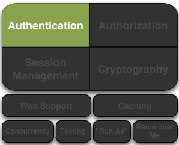

> 原文链接：https://shiro.apache.org/authentication.html#Authentication-sequence

[toc]

----

# 写在前面

这里根据写者个人的理解将一下单词翻译成更贴近框架的使用。如有不当，欢迎留言。

- Subject。操作用户
- principals。身份信息标识属性，偏向授权
- credential。身份凭证，偏向认证


# 前言

认证是身份验证的过程。也就是说，证明确实是他们所说的那个用户。

为了让用户能够证明自己的身份，他们需要提供一些身份信息，以及某些系统理解和信任的身份证明。

这是需要通过提交用户的主体和凭证给 Shiro 来完成的，用来查看它们是否匹配应用程序所预期的。

- **主体(Principals)** 是 操作用户的“标识属性”，主体可以是用来标识操作用户的任何东西。例如名字（给予的名字），最后一个名（姓氏或家族名称），一个用户名，身份号码等。当然像是姓氏这样的并不能很好地作为操作用户的唯一标识，所以最好的主体是使用应用系统提供的唯一身份验证，通常是用户名或者邮箱地址。

  > 主要的主体(Primary Prinicipal)。
  >
  > 当Shiro 可以展现任意数量的主体时，Shiro 期望应用系统中只有一个“主要的“主体 ——在应用系统内唯一标识 操作用户 的单个值。这在大多数应用系统中通常是用户名、邮箱地址或者全局唯一用户ID 。

- **凭证(Credential)**  通常是是只有 操作用户 知道的加密值，这被用来作为他们实际上”拥有“声称的身份的支持证据。一些常见的凭证示例包括密码，生物识别数据(例如指纹，视网膜扫描和X509证书[数字证书])。

最常见的 主体/凭证 配对例子是用户名和密码。用户名是所声称的身份，而密码是符合声称的身份的证据。如果提交的密码与应用系统所期望的相符，那么应用系统在很大程度上可以假设用户就是他们所说的那个人，因为其他人不应该知道相同的密码。

 





# 认证问题

一个操作用户进行身份验证的过程可以有效地分成三个不同的步骤：

1. 收集操作用户提交的主体和凭证；
2. 提交的主体和凭证进行身份验证；
3. 如果提交成功，则允许访问，否则重新验证或拒绝访问。

## 第一步：收集操作用户提交的主体和凭证

```java
// 使用用户名/密码组合最常见的场景示例
//Example using most common scenario of username/password pair:
UsernamePasswordToken token = new UsernamePasswordToken(username, password);

// 设置“记住我”
//"Remember Me" built-in:
token.setRememberMe(true);
```

在这个本例子中，我们使用 UsernamePasswordToken，支持大部分常见的 用户名/密码 身份验证方法。这实现了 Shiro 框架的 AuthenticationToken 接口，它是 Shiro 的身份验证系统用来表示提交主体和凭证的基本接口。

这里需要注意的是Shiro 并不关心你是如何获取这些信息的：也许数据是从用户提交的HTML表单中获取的，或者它可能是从HTML 头部信息中检索出来的，或者也许是从一个Swing 和 Flex GUI 密码表单中读取的，或者可能是通过命令行参数。将应用系统终端用户收集信息的过程与Shiro AuthenticationToken 的概念完成解耦。

你可以构建和表示任何你想要的 AuthenticationToken 示例——它是协议无关的。

在这个示例中还展现了，我们希望Shiro为这次身份验证尝试中执行“记住我”服务。这确保了如果他们在稍后返回应用系统时，Shiro记住了用户身份。我们将在后面的章节里涉及Remember Me 服务。

## 第二步：提交主体和凭证

主体和凭证完成收集并表示为 AuthenticationToken 示例后，我们需要提交这个token 给Shiro执行实际的身份验证尝试。

```java
Subject currentUser = SecurityUtils.getSubject();

currentUser.login(token);
```

获取当前执行的操作用户后，我们通过最近创建的AuthenticationToken 实例来完成一次单独的 登录 调用。

调用登录方法来有效地表述一次身份验证尝试。

## 第三步：处理成功或失败

如果登陆方法没有任何异常返回，那意味着——我们成功完成了！操作用户已经通过身份验证了。应用系统线程可以不间断地继续了，并且所有对SecurityUtils.getSubject()的调用将会返回经过身份验证的操作用户实例，还有调用subject.isAuthenticated()将会返回 true。

但是如果登陆尝试失败了，会发生什么呢？例如，如果终端用户提供了一个错误的密码，或者进入系统太多次，导致他们的账号被锁定，应该怎么办？

shiro 有丰富的运行时异常 AuthenticationException 可以精确地表示为什么会尝试失败。你可以包裹 Login 方法在 try/catch 块中，来捕捉你希望捕捉的任何异常，并相应地对它们做出反应。例如：

```java
try {
    currentUser.login(token);
} catch ( UnknownAccountException uae ) { ...
} catch ( IncorrectCredentialsException ice ) { ...
} catch ( LockedAccountException lae ) { ...
} catch ( ExcessiveAttemptsException eae ) { ...
} ... catch your own ...
} catch ( AuthenticationException ae ) {
    //unexpected error?
}

//No problems, continue on as expected...
```

如果现有的异常类不能满足你的需要，可以通过创建自定义 AuthenticationException 来表达特殊的失败场景。

> 登陆失败提示
>
> 当你的代码对特定异常做出反应并根据需要执行逻辑时，最佳安全实践是在失败事件中只展示通用的失败信息给终端用户。例如，“错误的用户名或密码。”。这确保了可能企图攻击系统的黑客没有得到特别信息。

# 记住 vs 已验证

如上例所示，Shiro支持在普通的登录过程附加 “remember me” 的概念。值得一提的是，Shiro对 remember(记录中的) 操作用户和实际 authenticated(已验证的) 操作用户之间做出非常精确的区分。

- remember(记忆中的)：一个记录中的操作用户不是匿名的，而是已知身份的（也就是 subject.getPrincipals() 是非空的）。但是这个身份信息是在上一个会话期间从上一个身份验证中记录的。如果 subject.isRememberd() 返回true，则认为这个操作用户是已经被记住了的。
- Authenticated(已验证的)：一个已验证的操作用户是指操作用户当前会话中成功完成身份验证（也就是说 login 方法被调用且没有抛出任何异常）。如果 subject.isAuthenticated() 返回 true，则认为这个操作用户是已经验证了的。

> 互斥性
>
> remember(记忆中的)和authenticated(已验证的)是互斥的——一个为真，则另一个为假，反之亦然。

## 为什么会有区别

“认证”这个单词具有非常强的证明意味。也就是说，有一个预期保证就是操作用户能证明他们就是他们所说的那个人。

当用户只被记住之前与应用系统的交互时，证明状态不再存在：记住身份能让系统知道用户可能是谁，但是事实上，没有办法绝对保证记住的操作用户表示的就是期望用户。一旦操作用户被验证，他们将不再认为只是被记住了，因为他们的身份信息会在当前会话被验证。

因此尽管应用系统的许多部分依然可以基于记住的主体执行独属于用户的逻辑，例如定制化视图，在用户通过成功执行身份验证尝试，合法地验证其身份之前，通常不允许执行高敏感操作。

例如，查看操作用户是否可以访问财务信息 几乎都是依赖于 isAuthenticated()，而不是 isRemembered()，来确保一个预期的和经过验证的身份。

## 图解示例

